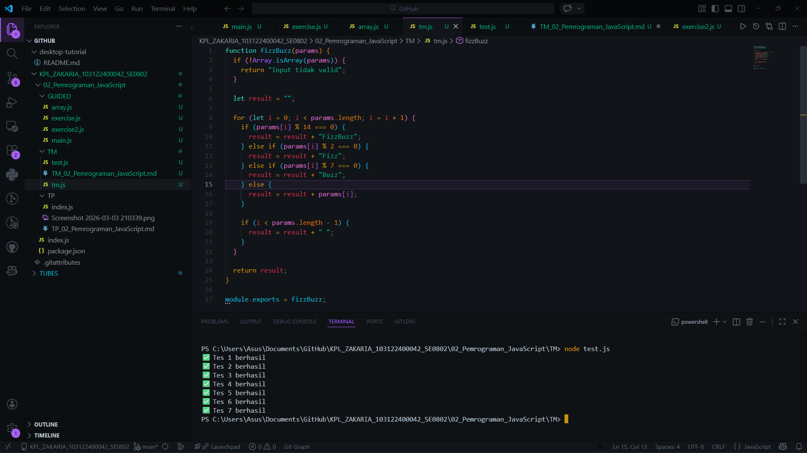

# Tugas Mandiri 02: Pemrograman JavaScript

## Soal

Buatlah sebuah fungsi bernama fizzBuzz yang menerima input larik (array) dan mengembalikan deretan bilangan dan "Fizz" untuk kelipatan 2, "Buzz" untuk kelipatan 7, dan "FizzBuzz" untuk kelipatan 14.

## Kode sumber

Tersedia di tm.js

## Output

## Deskripsi Program

Program ini mendefinisikan sebuah fungsi bernama fizzBuzz yang bertugas untuk memproses sekumpulan angka di dalam larik (array) dan mengubahnya menjadi deretan teks (string) tunggal berdasarkan aturan kelipatan tertentu.