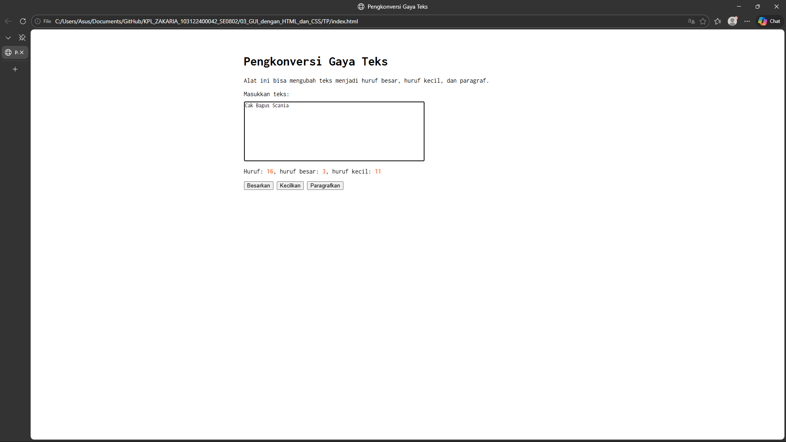

# Tugas Pendahuluan 02: Pemrograman JavaScript

## Soal

Buatlah tata letak laman yang kamu buat berada di tengah seperti di bawah ini, dan juga ubah font-nya dengan Inconsolata dari Google Fonts.

## Kode sumber

Tersedia di index.html, index.css dan index.js

## Output

## Deskripsi Program

Program ini adalah sebuah aplikasi web statis yang dirancang menggunakan tiga pilar utama pengembangan web: HTML untuk kerangka struktur, CSS untuk desain dan tata letak, serta JavaScript untuk memberikan interaktivitas (event-driven programming) melalui manipulasi DOM (Document Object Model).
Secara spesifik, penambahan JavaScript pada program ini berfungsi untuk menganalisis teks yang diketik oleh pengguna secara langsung (real-time).