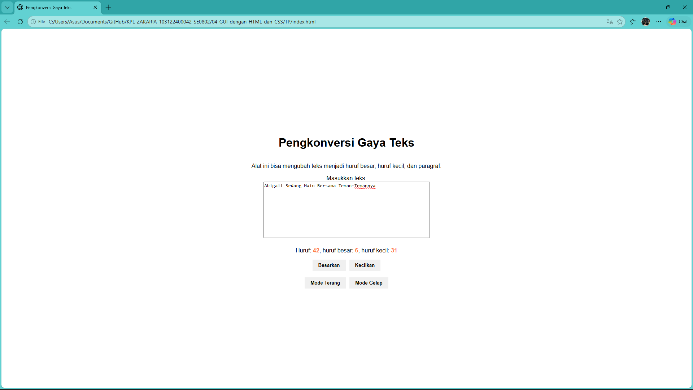
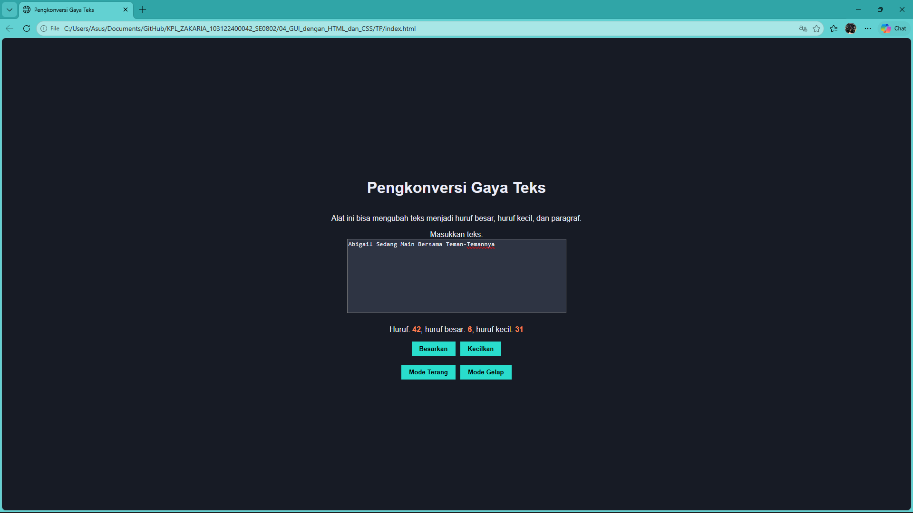

# Tugas Pendahuluan 03: Pemrograman JavaScript

## Soal

Tambahkan mode gelap sekaligus untuk editor-kecil dan tombol-tombolnya. Ketentuan warna untuk latar belakang editor-kecil adalah #2e3443, sementara untuk tombol adalah #29ddcc. Teks untuk tombol tetap mengikuti warna teks sebelumnya.

## Kode sumber

Tersedia di index.html, index.css dan index.js

## Output

## Deskripsi Program

Otomata adalah mesin abstrak yang mengurai input ke dalam berbagai keadaan, disebut state, tahap demi tahap, hingga sampai pada state yang diinginkan (atau tidak diinginkan). Otomata terdiri dari satu atau sekumpulan state dihubungkan oleh transisi (panah) yang memungkinkan sistem berpindah dari satu state ke state lainnya. Setiap otomata memiliki awal state dan akhir state, dan perpindahannya dipicu oleh masukan.